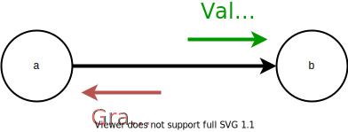

# [Backpropagation Visualization](https://jinay.dev/backprop-vis)

A simple tool to help visualize the use of backpropagation on a computation
graph. Shows the computation graph given any expression and demonstrates how
gradients are calculated on that expression.

## Usage

To explore the flow of gradients in your computations:

1.  Input an expression into the text box and watch your computation graph automatically generate
    -   Ex: `5x+3`, `(3+y)^z`, `2.718^(-t)`
    -   The visualization supports addition, subtraction, multiplication, division, parenthesis, and exponents
    -   Use single-letter variable names to define your variables
2.  Navigate the computation graph by panning across the screen by holding down your mouse

3.  Insert the values you would like for each of the variables in your computation

4.  Click on "Compute" to see the final output of the expression.

5.  Click on "Find Gradients" to see how gradients flow backwards in the computation graph using backpropagation

Each node in the graph transmits values to their parent nodes during forward
propagation. During the gradient calculation step, the parents send gradients
to their children using the chain rule. See the diagram below.

  

